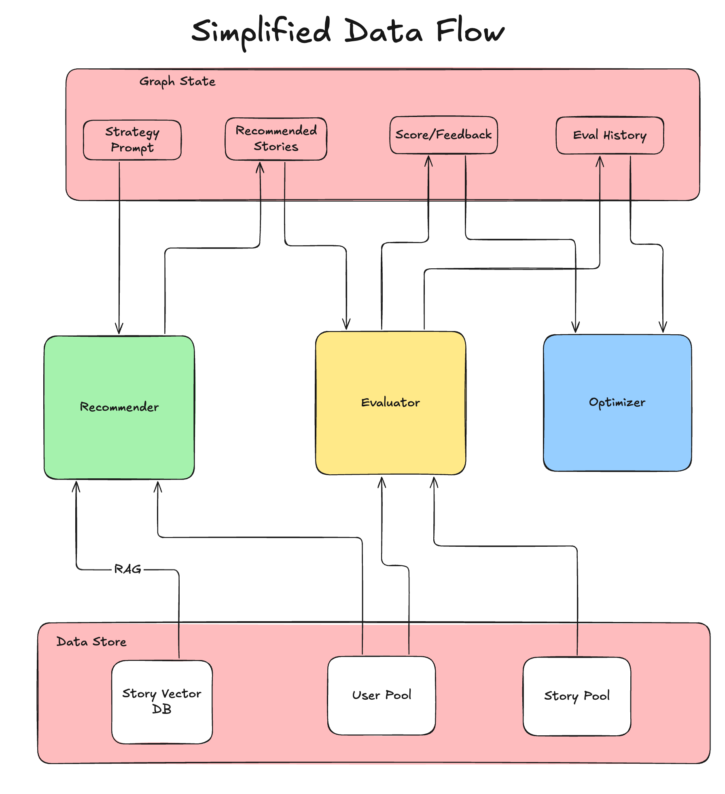
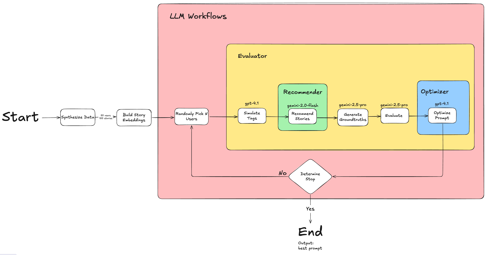

# Sekai Optimizer: AI-Powered Story Recommendation System

**Architecture:** Granular Node Workflow with LangGraph  
**Development Strategy:** Skeleton-First with TDD

---

## 🚀 Quick Start

## Requirments:

- **Docker** needs to be installed and running.

### One-Command Execution (Recommended)

**Prerequisites:** Set up your environment variables first:

```bash
# 1. Clone the repository
git clone https://github.com/meng-tsai/sekai-exam.git
cd sekai-exam

# 2. Set up environment variables
cp .env.example .env
# Edit .env and add your API keys:
# - OPENAI_API_KEY=your_openai_key_here
# - GOOGLE_API_KEY=your_google_key_here
# - LANGSMITH_API_KEY=please_contact_the_auther_for_this_key

# 3. Run the complete system
chmod +x run.sh
./run.sh
```

> **📧 LangSmith Access:** Contact the repository author for the `LANGSMITH_API_KEY` and LangSmith account access to observe run **[tracings](https://smith.langchain.com/o/08e74be8-0745-42c8-a717-b51f3a776467/projects/p/edb794d7-35c9-4d7c-ab02-d0dd2504e6d5)** and detailed workflow analytics.

### Manual Execution

```bash
# 1. Set up environment
python -m venv venv
source venv/bin/activate  # On Windows: venv\Scripts\activate
pip install -r requirements.txt

# 2. Configure environment variables (see .env setup below)
cp .env.example .env
# Edit .env with your API keys

# 3. Prepare data (one-time setup)
python -m sekai_optimizer.scripts.synthesize_data
python -m sekai_optimizer.scripts.build_index

# 4. Run the optimization workflow
python -m sekai_optimizer.main
```

### Graph-Only Execution

```bash
# Run just the optimization graph (assumes data is already prepared)
source venv/bin/activate
python -m sekai_optimizer.main
```

---

## 🎬 Live Demo: Optimization in Action

### Sample Execution Output

Here's what a real optimization run looks like with **3 iterations** and **3 users per batch**:

```
============================================================
📊 ITERATION CYCLE SCORES SUMMARY
============================================================
Iteration  P@10 Score   Semantic Score  Batch Size   Status
----------------------------------------------------------------------
#1         0.533        0.847           3
#2         0.733        0.934           3            🏆 BEST
#3         0.600        0.865           3
----------------------------------------------------------------------
📈 Total Iterations: 3
🎯 Best Performance: Iteration #2 with P@10 = 0.733
📊 Score Improvements: 1/2 iterations
📈 Average Score Change: +0.033 per iteration
============================================================
```

### Performance & Cost Analysis

**Resource Consumption:**

- **Total Tokens**: 164,106 tokens
- **Total Cost**: $0.18633895 (approximately $0.19)
- **Execution Time**: 6 minutes 31 seconds (391.35s)

### Iteration Stopping Rules

The optimization loop automatically terminates when **any** of these conditions are met:

#### 1. **Maximum Iterations Reached**

```bash
MAX_ITERATIONS=5  # Set in .env
```

#### 2. **Maximum Time Exceeded**

```bash
MAX_OPTIMIZATION_MINUTE=10  # Set in .env
```

## 🔧 Environment Setup

### Required API Keys

Before running the system, you must configure these essential API keys:

```bash
# Copy the example environment file
cp .env.example .env
```

**Edit `.env` and add your API keys:**

| Variable            | Description                          | How to Obtain                                                      |
| ------------------- | ------------------------------------ | ------------------------------------------------------------------ |
| `OPENAI_API_KEY`    | OpenAI API access for LLM operations | Get from [OpenAI Platform](https://platform.openai.com/api-keys)   |
| `GOOGLE_API_KEY`    | Google API for additional services   | Get from [Google Cloud Console](https://console.cloud.google.com/) |
| `LANGSMITH_API_KEY` | LangSmith observability platform     | **Contact repository author**                                      |

> **🔑 LangSmith Access Required:** The `LANGSMITH_API_KEY` and account access must be obtained from the repository author. This provides complete workflow tracing, debugging capabilities, and performance analytics for the optimization process.

---

## 📖 Project Overview

### What is Sekai Optimizer?

Sekai Optimizer is an autonomous AI system that iteratively learns to recommend highly-relevant stories to users. Built for the Sekai Take-Home Challenge, it demonstrates how AI agents can collaborate to optimize recommendation quality through continuous learning.

### Core Challenge

Build a multi-agent system that:

- **Learns**: Iteratively improves recommendation strategies
- **Adapts**: Optimizes prompts based on evaluation feedback
- **Scales**: Handles diverse user preferences efficiently
- **Generalizes**: Avoids overfitting to specific user patterns

### Key Innovation: Self-Optimizing Recommendation Loop

The system implements a closed-loop optimization workflow where AI agents continuously refine their recommendation strategies:

```
pick_users → simulate_tags → recommend_stories → generate_groundtruths → evaluate → optimize_prompt → repeat
```

---

## 🏗️ System Architecture

### Simplified Data Flow Overview



_The system implements a closed-loop optimization where three core agents (Recommender, Evaluator, Optimizer) collaborate through shared Graph State, accessing persistent data stores for stories, users, and vector embeddings._

### Detailed Workflow Architecture



_Complete workflow showing the initialization phase (data synthesis, embedding creation), the iterative optimization loop with specific LLM models for each component, and the conditional stopping mechanism._

### Granular Node Workflow (LangGraph)

The system is architected as a stateful graph using **LangGraph**, where each optimization step is a discrete, testable node:

#### Core Optimization Loop

1. **`pick_users_node`**: Randomly selects user batches for training diversity
2. **`simulate_tags_node`**: LLM-powered simulation of user tag preferences
3. **`recommend_stories_node`**: Two-Stage "Smart RAG" recommendation system
4. **`generate_groundtruths_node`**: Gold-standard recommendations for evaluation
5. **`evaluate_node`**: Scoring and feedback synthesis
6. **`optimize_prompt_node`**: Strategy prompt evolution based on feedback
7. **`determine_stop`**: Conditional stopping based on iterations/time limits

#### Two-Stage "Smart RAG" Architecture

**Stage 1 - FAISS Retrieval:**

- Semantic search using OpenAI `text-embedding-3-small`
- Retrieves top-25 candidate stories based on user tags
- Efficient vector similarity matching

**Stage 2 - LLM Re-ranking:**

- Intelligent re-ranking of candidates using strategy prompts
- Returns top-10 most relevant stories
- Balances relevance with diversity

### Technology Stack

- **🦜 LangChain & LangGraph**: Workflow orchestration and agent framework
- **🔍 LangSmith**: Observability, tracing, and prompt management
- **📊 FAISS**: High-performance vector similarity search
- **✅ Pytest**: Test-driven development framework
- **🐳 Docker**: Containerized deployment

---

## 📁 Repository Structure

```
sekai-exam/
├── 📚 Docs/                          # Project documentation
│   ├── engineering_design_doc.md     # Technical architecture
│   ├── implementation_plan.md        # Development roadmap
│   ├── goal.md                      # Challenge requirements
│   └── changelog.md                 # Development progress
├── 🔧 src/sekai_optimizer/           # Main source code
│   ├── 🤖 agents/                   # Agent implementations
│   │   └── evaluation/              # Evaluation agents & tools
│   ├── 📊 data/                     # Data models and state management
│   ├── 🔄 nodes/                    # LangGraph node implementations
│   ├── 📝 scripts/                  # Data synthesis and indexing
│   └── 🌊 workflows/                # Graph orchestration
├── 🧪 tests/                        # Comprehensive test suite
│   ├── agents/                      # Agent unit tests
│   ├── nodes/                       # Node unit tests
│   ├── scripts/                     # Script integration tests
│   └── workflows/                   # Workflow tests
├── 🐳 Dockerfile                    # Container configuration
├── 🏃 run.sh                        # One-command execution script
├── 📋 requirements.txt              # Python dependencies
└── ⚙️ .env.example                  # Environment template
```

### Key Components

#### Core Modules

- **`sekai_optimizer.main`**: Entry point and workflow execution
- **`sekai_optimizer.data.state`**: State management with best result tracking
- **`sekai_optimizer.workflows.graph_builder`**: LangGraph orchestration
- **`sekai_optimizer.nodes.*`**: Individual optimization step implementations

#### Data Infrastructure

- **`scripts/synthesize_data.py`**: Generates ~100 stories and ~50 user profiles
- **`scripts/build_index.py`**: Creates FAISS vector index for story retrieval
- **`data/types.py`**: Pydantic models for type-safe data structures

#### Testing Framework

- **Unit Tests**: Individual node and component testing
- **Integration Tests**: Cross-component validation

---

## 🔬 Development Methodology

### Test-Driven Development (TDD)

The project follows strict TDD principles adapted for LLM systems:

1. **Evaluation-Driven Development**: Write evaluation criteria before implementation
2. **Unit Testing**: Isolated component testing with mocked LLM calls
3. **Integration Testing**: Real data validation with selective mocking
4. **E2E Testing**: Complete workflow validation

### Implementation Strategy

**Skeleton-First Development:**

- Build complete LangGraph structure with stub implementations
- Establish E2E tests early for continuous integration
- Replace stubs incrementally with real logic
- Maintain system integrity throughout development

---

## 🎯 Evaluation & Metrics

### Hybrid Scoring Approach

**Primary Metric: Precision@10 (P@10)**

- Measures exact overlap between recommended and ground truth stories
- Provides clear, objective optimization signal
- Standard recommendation system metric
- Formula: `overlap_count / 10.0`

**Secondary Metric: Semantic Similarity**

- Measures semantic closeness between recommended and ground truth story sets
- Uses OpenAI `text-embedding-3-small` embeddings with cosine similarity
- Captures thematic alignment and provides smoother optimization gradients
- Handles cases where exact matches miss semantically similar stories
- Formula: `cosine_similarity(recommended_embeddings, ground_truth_embeddings)`

### Evaluation Process

1. **Ground Truth Generation**: LLM analysis of user profiles against complete story dataset
2. **Recommendation Generation**: Two-stage RAG system produces top-10 stories
3. **Dual Scoring**:
   - P@10 calculation for exact relevance matching
   - Semantic similarity for thematic alignment assessment
4. **Batch Aggregation**: Average both metrics across user batch using RunnableParallel
5. **Feedback Synthesis**: LLM-generated improvement suggestions based on both metrics

### Generalization Strategy

- **User Rotation**: Random batch selection prevents overfitting
- **Batch Evaluation**: Multiple users per iteration for robustness
- **Historical Context**: Optimization considers previous iteration learnings
- **Best Result Tracking**: Preserves optimal strategies across iterations

---

## 🚀 Production Readiness

### Scalability Features

- **Singleton Services**: Memory-efficient resource management
- **Batch Processing**: Concurrent user processing with RunnableParallel
- **Vector Indexing**: Pre-computed embeddings for fast retrieval
- **Stateful Workflows**: Resumable optimization processes

### Monitoring & Observability

- **LangSmith Integration**: Complete workflow tracing and debugging
- **Comprehensive Logging**: Detailed progress and error tracking
- **Performance Metrics**: Token usage and execution time monitoring

### Configuration Management

- **Environment Variables**: Flexible deployment configuration
- **LangSmith Hub**: Centralized prompt management and versioning
- **Docker Deployment**: Consistent execution environment

### Code Quality Standards

- **Type Hints**: Mandatory for all functions and methods
- **Pydantic Models**: Structured data validation
- **Black Formatting**: Consistent code style
- **Comprehensive Testing**: Unit, integration, and E2E coverage

---

## 📄 License

This project is part of the Sekai Take-Home Challenge and follows the terms specified in the challenge requirements.

---

**Ready to optimize? Run `./run.sh` and watch the AI agents learn! 🤖✨**
